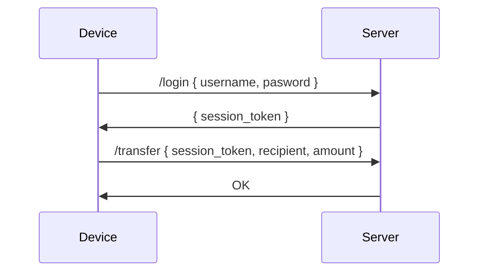
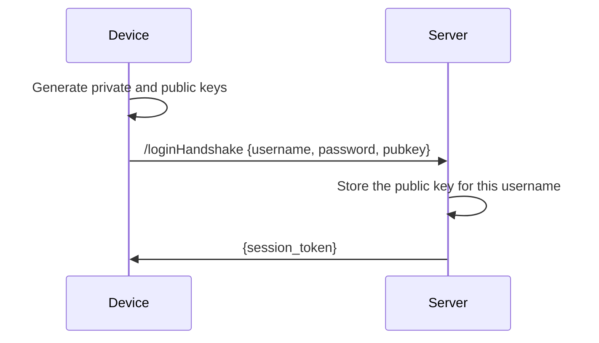
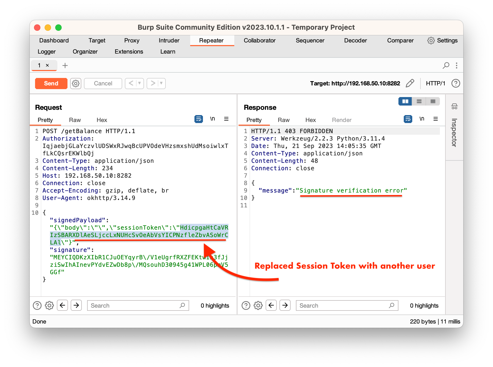
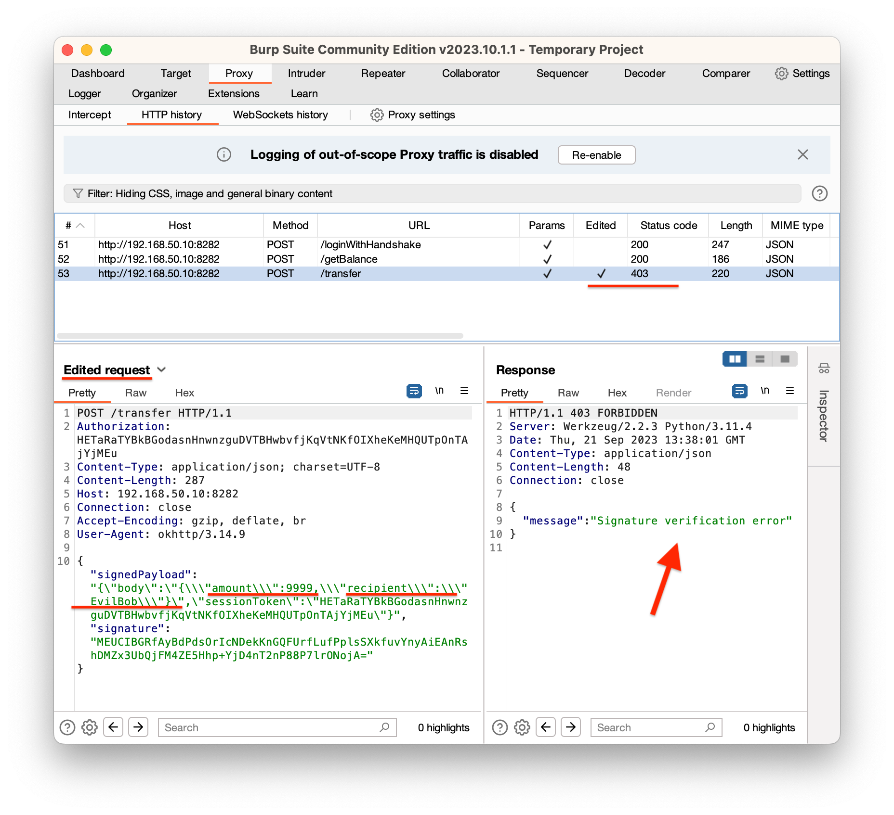

# Basic Device Binding Example

This project describes the integration of a basic Device Binding into your app. Firstly, let's describe a typical REST workflow without Device Binding, so that we can clearly see the differences between approaches.

You can read more about Device Binding in our blog post [Enhanced App Authentication Scheme with Mobile Device Binding](https://www.guardsquare.com/blog/mobile-device-binding). 


### Typical workflow of REST API (without Device Binding)




In this approach, **once a session token is leaked, the attacker can perform an arbitrary operation on user's behalf**. Even if Multi-Factor authentication is enabled, it's mostly required at signing in. If an attacker steals the token after a user is signed in, they can still perform all operations.

An attacker can use **MITM attack to intercept all network between the device and the server to modify the content** of the REST request to e,g, moduify the recipient field in JSON.


### REST API with Device Binding

In Device Binding approach we **sign every request with a private key** that is available only on the device and verify it on the backend side. Firstly, a device need to tell the server what public key to use. This step is called **Handshake**. 


#### Handshake

In this sample project, we combined `/login` with the handshake and pass public key together with username and password to the server.





The handshake occurs only once. The next time you want to sign in, you don't need to pass public key in the request. You can just sign the whole message in the same way as we do below in the Communication phase.

(Optionally) In a more advanced approach, you should have a shared secret between youd device and the server and use it to HMAC the {username, password, pubkey}.


#### Communication

From this point onward the device will sign every request with the private key. 

For example, the `/transfer` request below will be replaces with a signed version of it.


**Original `/transfer` request**

```
HTTP POST /transfer

Headers:
 Authorization: XXYXYXXX

Body:
 {
  recipient: 'Jack',
  amount: 100
 }
```


**Signed `/transfer` request **

```
HTTP POST /transfer

Headers:
 Authorization: XXYXYXXX

Body:
	{
	 signedPayload: {
  	body: "{recipient: 'Jack', amount:'100'}",
   sessionToken: XXYXYXXX
  },
  signature: YYXYZXYZZZYYXZXXYZXYYYZXZXYZY
 }
```


Once this signed request arrives at the server side, the server will check the integrity of the `signedPayload` by veryfing the `signature` with the `public key ` from the handshake phase. 

To ensure the integrity of the Authorization/Session token, we can move it completely from the HTTPS headers to the `signedPayload`.


### Verification

You can verify that an attacker can't leverage a stolen Session Token or MITM attack by intercepting the network traffic and tampering with the requests.


#### Stolen Session Token

I replaced the `session token` with another valid token of another user. The server detected tampered coated thanks to signature validation.




#### Tampering recipient with MITM

In this attack scenario, I modified `amount` and `recipient` but the server couldn't verify the signature, so it responded with HTTP `403` error and an appriopriate message.



### Limitations

This basic implementation of device binding doesn’t protect against replay attacks. To mitigate the issue, integrate a nonce challenge.


## Usage

### Server

The server for this example is implemented in python

1. Install dependencies `pip3 install -r requirements.txt`
2. Run python server with `python3 ./server.py`


### Android

Import the `android` directory into the Android Studio project and build the project.

For compatibility reasons `setIsStrongBoxBacked(true)` is commented out but you should keep it enabled for all compatible devices.

Currently, the `BASE_URL` of the server is set to `http://192.168.50.10:8282`. Once you run the server, update this value with the new IP address. You can find `BASE_URL` in `RaspApiClient.kt`. 

The project uses `network_security_config.xml` , so make sure to update this config to allow clear-text traffic to your new IP address. Below, you can find a relevant line of code you need to update.

```
<domain includeSubdomains="true">192.168.50.10</domain>
```


Happy coding
